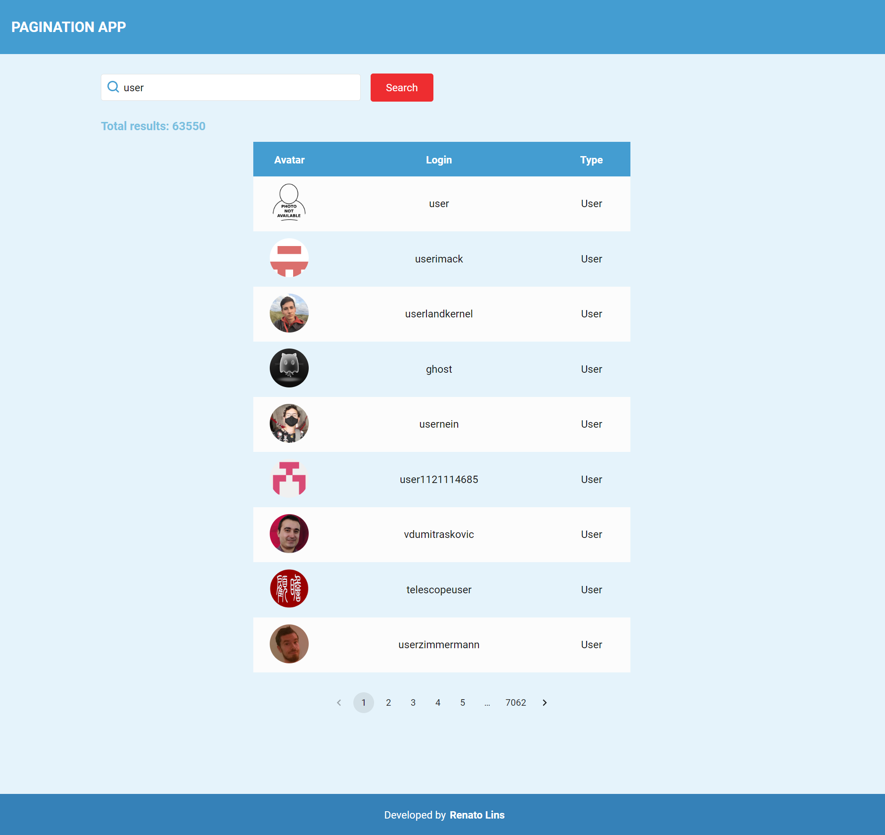

# Pagination and context API

This project implements a pagination system (based on Github users) with the help of React's Context API. If you want to see it running, check this [Demo](https://pagination-with-context-api.netlify.app)



# Running on development mode

1) Install dependencies by running the command: ```yarn```

2) Run the app with: ```yarn start```

# Using the app

By searching for a term, you'll get a list of users somewhat related to that search term. If the API returns more than 9 results, it will be paginated.

# Characteristics of this project

* It uses API calls based on hooks patterns(services as custom hooks). For the sake of simplicity, all components would be getting data from context provider, and the services are the only type of code that can update the context. This will make things easier and prevent re-renderings or any data sourcing confusion. This is how the flow of data is wired to the UI:
  
__Component => Service => Context => Component__

(A component will access a service. A service will update de context(based on external data). Context will then update the component)

Ps. The above flow of data will help achieving the next couple characteristics
 
* Components are mostly free of business logic. Even though some components must be tied to certain domain data, making components as dumb as possible helps on: shareability, testability and maintainability

* With the help of Styled components lib, every UI element is mapped to a component. This way, every element is named(easy to identify), we will have no css clash problems, it will be easy to share and to refactor + a lot of benefits tied to JSS approach. Also we can remember that: If everything is a component, than everything can be tested!

* Domain and shared/common components are well separated. This will not just enhance code quality, but it allows us to identify components can become part of a shared library (based on a design system for example)

* Almost everything is covered with Typescript types

* Components are always colored via a theme object, which works as a central source of core styling. This will not just improve maintainability but helps on enabling usage of any theme(both as standard or in real time). This way, switching themes and/or having dark mode would be as easy as it can be